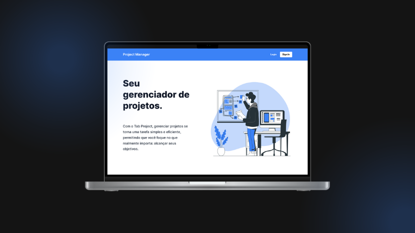

<p align="center">
  
</p>

<p align="center">
  

  

  
</p>

<h1 align="center">
    Project Manager WEB
</h1>

<br>

## 🧪 Tecnologias

Este projeto foi desenvolvido utilizando as seguintes tecnologias:

- [Vite.Js](https://vitejs.dev/)
- [React.Js](https://react.dev/)
- [React-Router](https://reactrouter.com/en/main)
- [React-Toastify](https://fkhadra.github.io/react-toastify/introduction)
- [React-Hook-Form]https://react-hook-form.com/()
- [Styled-Components](https://styled-components.com/)
- [TypeScript](https://www.typescriptlang.org/)
- [Git](https://git-scm.com/)

## 🚀 Executando projeto

Clone o projeto.

```bash
git clone https://github.com/Robson-Carvalho/project-manager-web.git
```

Acsse a pasta do projeto clonado.

```bash
cd project-manager-web
```

Execute o comando abaixo para baixar as dependências do projeto.

```bash
npm install
```

Execute o comando abaixo para rodar o projeto.

```
npm run dev
```

## 📖 Descrição do projeto

Interface de usuário para manipular as informações e visibilidades dos projetos cadastrados de forma intuitiva e prática.

## 📝 Licença

Este projeto está licenciado sob a licença MIT. Veja o arquivo [LICENSE](./LICENSE) para mais detalhes.

---

Feito com 💜 por [Robson Carvalho](https://portfolio-robson-carvalho.vercel.app/) 👋
